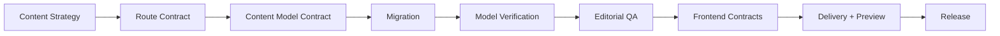
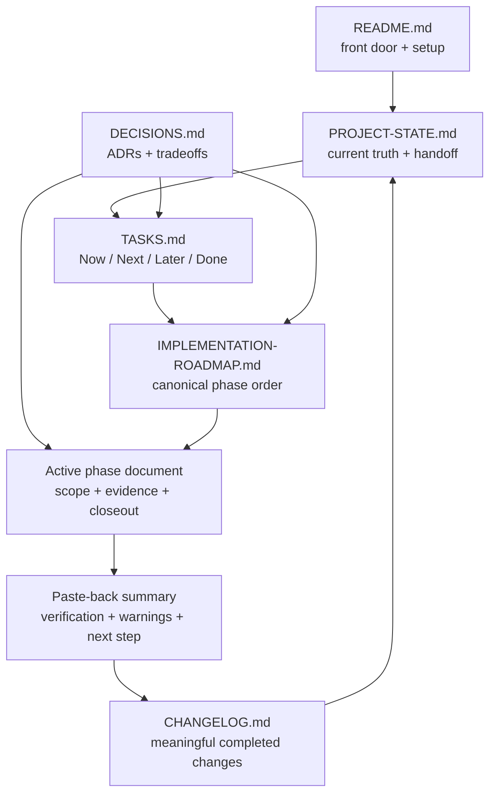

# Contentful Greenfield Starter

A production-minded Contentful project showcasing how I design scalable CMS architecture for a personal website using semantic content models, safe environment workflows, migration-driven schema management, and CMS-agnostic frontend contracts.

The repository demonstrates how I approach content systems with the same structure, documentation, and validation practices used in professional web and CMS environments.


> **Architecture North Star**
>
> Content strategy before content models.<br>
> Routes before templates.<br>
> UI contracts before CMS data.<br>
> Static fixtures before Contentful.<br>
> Validation before closeout.<br>
> Documentation is part of the build.

## Why This Project

Contentful can model a personal website as a durable content system instead of a set of component-shaped database tables. This starter keeps editorial meaning separate from frontend implementation by modeling concepts such as projects, articles, experience, skills, navigation, tools, and lean SEO override inputs.

The project also shows how enterprise CMS practices scale down cleanly: field IDs are governed as API contracts, model changes begin as migrations, snapshots support portability, secrets stay server-side, environments are explicit, and phase gates require evidence before closeout.

## Project Status

| Area | Current state |
| --- | --- |
| Current project state | Phase 05 - ACTIVE by the externally final-validated containing commit for Batch 05.1; containing-commit rule below |
| Latest completed phase | Phase 04 - COMPLETE / FROZEN at `6fdb16f06c5338e11f08ae0a44180b6db4251611`; model `v1.0.0` frozen |
| Phase 04 closeout checkpoint | Batch 04.6 / `6fdb16f06c5338e11f08ae0a44180b6db4251611` / External Checkpoint Validation PASS WITH NOTES |
| Current Batch 04.3 state | Conditionally exited for findings handoff / incident, forensics, and cleanup complete / zero-content `dev` baseline restored / exhaustive live QA deferred / known evidence limitation preserved |
| Partial-authoring deferral reconciliation | Implementation complete / External Validation PASS WITH NOTES / Final Approval Reconciliation complete |
| Partial-authoring incident checkpoint | Established at `93e4ff6dd995831af5d05475db02b1a60f027715` |
| Post-stop forensic gate | Complete / External Validation PASS WITH NOTES / 14 GET-equivalent requests / 0 writes / 0 retries or replays |
| Forensic/recovery checkpoint | Established at `7f36c66e30b8a9297f3ee3a1a72baf76eef7d2a1` |
| Authoring-envelope finding | Historical 111 ceiling is proven insufficient for execution; 201 / 216 are unapproved forensic planning bounds only |
| Batch 04.2 corrective checkpoint | Established at `46ba9c0ee0a0cf0a09736aa867eb76619f44d702` |
| QA fixture checkpoint | Established at `2c590bf674759159061dcdc8700993adb96d321d`; external checkpoint validation: Git mechanics PASS / canonical truth consistency NEEDS REVISION |
| First truth corrective checkpoint | Established at `591725c3abdb0e829700cdbbb77a023628525781`; external checkpoint validation: Git mechanics PASS / canonical truth consistency NEEDS REVISION |
| Selected recovery route | Option B - governed cleanup complete; any full restart requires guard, branch-safe envelope, and evidence-contract correction first |
| Cleanup execution | External Validation PASS WITH NOTES / 19 Entry deletes / 3 Asset unpublishes / 3 Asset deletes / exact 25 mutations / 0 retries or replay |
| Cleanup authorization | Renewed authorization consumed exactly once / closed / additional cleanup not authorized |
| Cleanup-result checkpoint | Established at `c9c33a0b32e449e639fe2e4d32f3fa9b6cdcc819` / clean synchronized `0 0` externally validated |
| Deferred QA Harness Hardening | Post-findings engineering debt / complete plan is 220 Entry updates, 2–92 publication attempts, and 494 maximum requests / not implemented or authorized |
| Conditional-exit decision checkpoint | Established at `b9a61a328c6353881ea10dd5384b7a9c02d65e3d`; external checkpoint validation passed before Batch 04.4 entry |
| Batch 04.4 findings gate | Complete / External Validation PASS WITH NOTES |
| Batch 04.4 reconciliation | Findings reconciled / CLASS 0 / corrected `A=10 / B=44 / C=2 / D=15 / E=2 / F=0 / G=0 / H=29` ledger / no model or Editor Interface technical correction |
| Batch 04.4 reconciliation External Validation | PASS WITH NOTES |
| Batch 04.4 checkpoint | Established at `8ec8c08b02f10a13c19a59a92f9dc70c1f669911` / External Checkpoint Validation PASS |
| Batch 04.5 handoff | Exact 44 Class B scenarios mapped with 0 missing and 0 extra |
| Batch 04.5 implementation | Editorial workflow and field guidance complete / checkpointed / External Checkpoint Validation PASS / 15 of 15 exit criteria pass |
| Batch 04.6 final validation | PASS WITH NOTES / externally validated PASS WITH NOTES / exactly 23 GET / 0 writes / 0 retry, replay, pagination, or concurrency |
| Batch 04.6 disposition | Option B accepted / exhaustive 102 / 102 live QA not completed / Deferred QA Harness Hardening remains post-freeze debt |
| Batch 04.6 reconciliation lifecycle | Complete / checkpoint established at `6fdb16f06c5338e11f08ae0a44180b6db4251611` / External Checkpoint Validation PASS WITH NOTES |
| Model freeze decision | `v1.0.0` FROZEN by the established Phase 04 closeout checkpoint |
| Phase 04 exit | 11 of 11 criteria satisfied; criteria 3-5 remain visibly evidence-bounded |
| Current planning batch | 05.1 Source-Readiness Reconciliation / PASS WITH NOTES / externally validated / Final Approval Reconciliation implemented |
| Previous 04.3 authoring authorization | Historically granted / unconsumed; superseded for actionability and must not be reused |
| Latest 04.3 authoring authorization | Granted once / consumed by the TA-01 Asset upload / no continuation, retry, repair, or cleanup authorized |
| Batch 04.1 external validation | PASS WITH NOTES |
| Pre-export tooling | Approved |
| Content model | Approved V1 model contract |
| Migration implementation | Approved RE2-corrected V1 |
| Migration execution | Successful in `dev` |
| Approved checksum | `4a2319e069245d94a62e253acc9d4d67ad57f5e3450a143c71607f8c10360e24` |
| Current `dev` | Ready / exact 10-type model and 10 / 99 / 18 / 102 / 10 / 8 / 6 / 2 contract / 0 material drift / 0 Entries / 0 Assets / 0 tags / no `qa04-` artifacts |
| Pre-rotation model validation | Approved - zero material drift; preserved in recovery snapshot |
| `master` | Ready / protected blank / 0 types / 0 entries / 0 assets / 0 tags / en-US |
| Gate B authorization | Consumed |
| Additional bootstrap | Not authorized |
| Destructive recovery | Complete / externally approved; additional reset not authorized |
| Environments | `master` + `dev` |
| Bootstrap migration | Executed successfully in `dev` |
| Export | Complete / one authorization consumed |
| Snapshot | Created / approved for recovery use |
| Destructive rotation | Complete exactly once; blank-state validation passed |
| Destructive authorization | Consumed; second rotation not authorized |
| Import | Executed exactly once / authorization consumed / operational exit 1 after HTTP 429; second import not authorized |
| Semantic recovery | PASS / clean-room comparison PASS / zero material drift |
| Phase 03 technical exit criteria | 22 / 22 PASS |
| Phase 04 | COMPLETE / FROZEN; Option B, R88, and incomplete exhaustive-QA limitation preserved |
| Seed content | Not started |

**Batch 05.1 containing-commit rule:** After External Final Validation PASS for this exact reconciliation, its containing commit establishes Phase 05 ACTIVE and Batch 05.1 APPROVED / CHECKPOINTED. Batch 05.2 is NEXT / LOCAL ONLY only after External Checkpoint Validation PASS for that containing commit.

Original 05.1 source-readiness result: historical BLOCKED. Working inventory: 42 Entries / 8 Assets; placeholders allowed only in planning and local development. Accepted final dry run requires `placeholder_count = 0` plus complete fields, sources, hashes, links, and rights. 05.3 is BLOCKED ON SOURCE COMPLETION; 05.4 is NOT AUTHORIZED; 05.5 is LATER; seed is NOT STARTED. No Contentful access is authorized.

See [Phase 05](docs/phases/PHASE-05-REPRESENTATIVE-SEED-CONTENT.md), [seed contract](docs/system/REPRESENTATIVE-SEED-CONTENT-CONTRACT.md), and [05.1 evidence](content-model/reports/PHASE-05-BATCH-05.1-SEED-PLANNING-AND-SOURCE-READINESS.md).

> For canonical current state, see [docs/PROJECT-STATE.md](docs/PROJECT-STATE.md) and [TASKS.md](TASKS.md).

## What This Repository Demonstrates

- **Migration-first schema governance** - Content model evolution is represented through version-controlled migration intent.
- **Semantic Contentful modeling** - Editorial concepts remain independent of React component implementation.
- **Field-ID contract discipline** - Contentful field IDs are treated as long-lived API surfaces.
- **Two-environment CMS safety** - `master` remains protected while `dev` acts as the single rotating sandbox.
- **Model portability** - model-only snapshots support reproducible verification without replacing migration history.
- **CMS-agnostic frontend boundaries** - raw Contentful response shapes stay outside presentational UI.
- **Secret handling discipline** - management, delivery, and preview credentials remain separated and server-side.
- **Evidence-based delivery** - phase progress depends on recorded repository, command, or CMS evidence.

## Architecture Overview



The implementation sequence keeps CMS decisions upstream of templates and keeps UI-facing contracts ahead of live Contentful integration. The full phase sequence, gates, and dependencies live in [docs/IMPLEMENTATION-ROADMAP.md](docs/IMPLEMENTATION-ROADMAP.md).

## Environment Strategy

| Environment | Responsibility | Current posture |
| --- | --- | --- |
| `master` | Permanent protected baseline and future release target | Ready / protected blank; 0 types / 0 entries / 0 assets / 0 tags / en-US |
| `dev` | Single rotating sandbox for migration development, model review, and editorial QA | Cleanup final proof: ready, exact zero-drift 10-type model, 0 entries, 0 assets, 0 tags, and no `qa04-` artifacts |

Verification is a workflow state, not a third Contentful environment.

Phase 03 Batches 03.1 through 03.6 are approved / checkpointed and Phase 03 is complete / frozen. Commit `33e01ae068769631b3bd997b28711535f7c7b340` activated Phase 04 and checkpointed Batch 04.1. Batch 04.2 remains historically approved / checkpointed, and its historical 111 Entry-update envelope is checkpointed at `0e2057d26031d3ba7264810d00173713d83c11ef`. A later one-time authorized Batch 04.3 process consumed its authoring authorization with the TA-01 Asset upload, created all 19 temporary Entries and 3 temporary Assets, completed 39 Entry update attempts and no Entry publication attempt, and stopped fail-closed at R88 after HTTP 422. The completed forensic gate confirmed atomic rejection, the transformed-error guard defect, unresolved exact field attribution, the insufficiency of 111, and non-controlling 201 / 216 planning bounds. Governed cleanup restored zero-content, zero-drift `dev`; Batch 04.3 remains conditionally exited without a 102 / 102 live QA claim. Batch 04.4 reconciled the corrected ledger as CLASS 0 with no model or Editor Interface technical correction. Batch 04.5 is checkpointed at `157f9dd5d1c471d5e5087c0046b28fa97fb86d91` after External Checkpoint Validation PASS. Batch 04.6 final validation and its external review returned PASS WITH NOTES: one process consumed authorization at `2026-08-26T03:31:56.610Z`, completed exactly 23 GET requests with 0 writes or retries, reconfirmed blank `master`, and proved exact zero-drift `dev`. Option B is accepted with the visible limitation that exhaustive 102 / 102 live QA was not completed; Deferred QA Harness Hardening remains required before another exhaustive run, and 220 / 2-92 / 494 remain planning values only. The model freeze decision is `v1.0.0`, and all 11 Phase 04 exit criteria are satisfied with criteria 3-5 evidence-bounded. The initial closeout reconciliation remained correctly BLOCKED; the three-pointer correction completed, Resume External Validation returned PASS WITH NOTES, and Final Approval Reconciliation is complete. The Phase 04 closeout checkpoint `6fdb16f06c5338e11f08ae0a44180b6db4251611` established Batch 04.6 and froze `v1.0.0`; External Checkpoint Validation returned PASS WITH NOTES. Phase 05 now follows the Batch 05.1 containing-commit rule above; seed remains NOT STARTED and no Contentful request is authorized.

## Repository Operating System



Each document owns a different part of project truth. The loop prevents implementation, planning, decisions, and closeout evidence from silently drifting apart.

## Quick Start

```bash
git clone https://github.com/gah-code/contentful-greenfield-starter.git
cd contentful-greenfield-starter

nvm use
npm install

cp .env.example .env.local

node -v
npm -v
npm run cms:help
```

> `.env.local` is intentionally ignored. Never commit Contentful credentials.

## Project Commands

| Command | Type | Purpose |
| --- | --- | --- |
| `npm run cms:help` | read-only | Inspect the locally installed Contentful CLI surface |
| `npm run cms:login` | manual authentication | Authenticate with Contentful only when a phase explicitly allows it |
| `npm run cms:env:check` | local safety check | Verify required env names are configured, target is `dev`, and secret values remain hidden |
| `npm run cms:env:list` | gated live read | List Contentful environments when Batch 00.4 authorizes direct environment evidence |
| `npm run cms:model:bootstrap` | mutating, not authorized | Run only when a later workflow grants fresh explicit authorization |
| `npm run cms:model:export` | gated live read | Export a model-only snapshot during the approved model verification phase |
| `npm run cms:model:import:verify` | mutating, gated | Import a model-only snapshot into fresh `dev` during Phase 03 verification |
| `npm run cms:model:verify:snapshot` | local read-only | Validate snapshot structure from a local model export file |

Do not run authentication, migration, export, import, or environment commands unless the current phase gate authorizes them.

## Repository Structure

```text
.
├── .codex/
│   └── skills/
├── content-model/
│   ├── migrations/
│   ├── snapshots/
│   └── reports/
├── docs/
│   ├── content-model/
│   ├── phases/
│   └── system/
├── scripts/
│   └── contentful/
├── README.md
├── TASKS.md
├── CHANGELOG.md
└── package.json
```

`.codex/` contains project-specific operating instructions, `content-model/` holds migrations and portable model artifacts, `docs/` owns canonical planning and architecture truth, and `scripts/` wraps Contentful CLI operations behind local safety checks.

## Roadmap

| Phase | Focus |
| --- | --- |
| 00 | Baseline + Two-Environment Setup - complete |
| 01 | Content Strategy + Route Contract - complete / frozen |
| 02 | Content Model Contract + Bootstrap Migration - complete / frozen |
| 03 | Model Export + Serial Clean-Room Verification - complete / frozen; Batch 03.6 approved / checkpointed |
| 04 | Editorial QA + Model Freeze - COMPLETE / FROZEN at the established Phase 04 closeout checkpoint |
| 05 | Representative Seed Content - 05.1 reconciliation externally validated; ACTIVE by its externally final-validated containing commit; 05.2 gated / LOCAL ONLY |
| 06 | Frontend Contracts + Adapter Boundary |
| 07 | Delivery Integration |
| 08 | Preview + Editorial Workflow |
| 09 | Quality Gates + Release |

See [docs/IMPLEMENTATION-ROADMAP.md](docs/IMPLEMENTATION-ROADMAP.md) for full gates and dependencies.

## Content Model Direction

The historical proposed v1 direction started from 10 semantic content types:

`seoMetadata`, `socialLink`, `navigationItem`, `siteSettings`, `personProfile`, `project`, `article`, `experienceItem`, `skill`, and `skillGroup`.

Phase 02 / Batch 02.2 approves the current v1 standalone type inventory: `siteSettings`, `personProfile`, `socialLink`, `navigationItem`, `project`, `article`, `experienceItem`, `skill`, `skillGroup`, and `tool`. Phase 02 / Batch 02.3 approves the field and field-ID contract. Phase 02 / Batch 02.4 approves the reference, validation, and editorial contract. Batch 02.6 approved the successful RE2-corrected bootstrap execution in `dev`. Batch 02.7 external validation approved the read-only live comparison with zero material contract drift, closing Phase 02 as complete / frozen. The approved inventory keeps semantic content separate from React components, absorbs the broad legacy `seoMetadata` type into owning editorial types, and adds `tool` as a standalone semantic type. Content type ownership lives in [docs/content-model/CONTENT-TYPE-LEDGER.md](docs/content-model/CONTENT-TYPE-LEDGER.md), field contracts live in [docs/content-model/FIELD-ID-LEDGER.md](docs/content-model/FIELD-ID-LEDGER.md), references live in [docs/content-model/REFERENCE-MAP.md](docs/content-model/REFERENCE-MAP.md), validation/editorial rules live in [docs/content-model/VALIDATION-AND-EDITORIAL-CONTRACT.md](docs/content-model/VALIDATION-AND-EDITORIAL-CONTRACT.md), and approved live evidence lives in [content-model/reports/PHASE-02-BATCH-02.7-LIVE-SCHEMA-VALIDATION.md](content-model/reports/PHASE-02-BATCH-02.7-LIVE-SCHEMA-VALIDATION.md).

## Documentation

### Current State

- [docs/PROJECT-STATE.md](docs/PROJECT-STATE.md) - current truth and handoff state
- [TASKS.md](TASKS.md) - Now / Next / Later / Done tracker
- [CHANGELOG.md](CHANGELOG.md) - meaningful completed changes

### Architecture

- [docs/DECISIONS.md](docs/DECISIONS.md) - ADRs and tradeoffs
- [docs/IMPLEMENTATION-ROADMAP.md](docs/IMPLEMENTATION-ROADMAP.md) - canonical phase sequence
- [docs/system/ENVIRONMENT-STRATEGY.md](docs/system/ENVIRONMENT-STRATEGY.md) - approved two-environment model
- [docs/system/SECURITY-AND-SECRETS.md](docs/system/SECURITY-AND-SECRETS.md) - secret and CLI boundaries
- [docs/system/CONTENT-STRATEGY.md](docs/system/CONTENT-STRATEGY.md) - frozen Phase 01 content-strategy input
- [docs/system/ROUTE-CONTRACT.md](docs/system/ROUTE-CONTRACT.md) - frozen Phase 01 route-contract input
- [docs/system/SEO-AND-METADATA-CONTRACT.md](docs/system/SEO-AND-METADATA-CONTRACT.md) - frozen Phase 01 SEO + metadata input
- [docs/system/CONTENT-REQUIREMENTS-MATRIX.md](docs/system/CONTENT-REQUIREMENTS-MATRIX.md) - frozen Phase 01 content requirements input

### Content Model

- [docs/content-model/CONTENT-TYPE-LEDGER.md](docs/content-model/CONTENT-TYPE-LEDGER.md) - semantic content-type ledger
- [docs/content-model/FIELD-ID-LEDGER.md](docs/content-model/FIELD-ID-LEDGER.md) - field ID contract ledger
- [docs/content-model/REFERENCE-MAP.md](docs/content-model/REFERENCE-MAP.md) - approved reference contract
- [docs/content-model/VALIDATION-AND-EDITORIAL-CONTRACT.md](docs/content-model/VALIDATION-AND-EDITORIAL-CONTRACT.md) - approved validation and editorial contract

### Phase Documents

- [docs/phases/PHASE-04-EDITORIAL-QA-AND-MODEL-FREEZE.md](docs/phases/PHASE-04-EDITORIAL-QA-AND-MODEL-FREEZE.md) - active Phase 04 editorial-QA contract, mutation boundaries, and model-freeze intent
- [content-model/reports/PHASE-04-BATCH-04.1-READ-ONLY-PLANNING-AND-EDITORIAL-QUALITY-PREFLIGHT.md](content-model/reports/PHASE-04-BATCH-04.1-READ-ONLY-PLANNING-AND-EDITORIAL-QUALITY-PREFLIGHT.md) - sanitized approved Batch 04.1 preflight evidence and editorial findings
- [content-model/reports/PHASE-04-BATCH-04.4-EDITORIAL-QA-FINDINGS-RECONCILIATION.md](content-model/reports/PHASE-04-BATCH-04.4-EDITORIAL-QA-FINDINGS-RECONCILIATION.md) - corrected 102-scenario findings ledger, CLASS 0 result, evidence limits, and frozen Batch 04.5 handoff
- [docs/system/EDITORIAL-WORKFLOW-AND-FIELD-GUIDANCE.md](docs/system/EDITORIAL-WORKFLOW-AND-FIELD-GUIDANCE.md) - canonical editor workflow, field guidance, publication checklist, and quick-start
- [content-model/reports/PHASE-04-BATCH-04.5-EDITORIAL-WORKFLOW-AND-FIELD-GUIDANCE.md](content-model/reports/PHASE-04-BATCH-04.5-EDITORIAL-WORKFLOW-AND-FIELD-GUIDANCE.md) - exact 44-scenario guidance mapping, exit criteria, and evidence boundaries
- [docs/system/EDITORIAL-QA-AND-TEMPORARY-AUTHORING-CONTRACT.md](docs/system/EDITORIAL-QA-AND-TEMPORARY-AUTHORING-CONTRACT.md) - approved/checkpointed Batch 04.2 scenario, temporary-artifact, authoring-envelope, and cleanup-boundary contract
- [docs/phases/PHASE-03-MODEL-EXPORT-AND-SERIAL-CLEAN-ROOM-VERIFICATION.md](docs/phases/PHASE-03-MODEL-EXPORT-AND-SERIAL-CLEAN-ROOM-VERIFICATION.md) - completed Phase 03 serial verification, incident/recovery evidence, and closeout state
- [docs/phases/PHASE-02-CONTENT-MODEL-CONTRACT-AND-BOOTSTRAP-MIGRATION.md](docs/phases/PHASE-02-CONTENT-MODEL-CONTRACT-AND-BOOTSTRAP-MIGRATION.md) - completed Phase 02 model and migration closeout
- [docs/phases/PHASE-01-CONTENT-STRATEGY-AND-ROUTE-CONTRACT.md](docs/phases/PHASE-01-CONTENT-STRATEGY-AND-ROUTE-CONTRACT.md) - completed Phase 01 closeout, frozen requirements evidence, and Phase 02 handoff boundary

## Safety and Governance

- Never bootstrap, import, or experiment against `master`.
- Keep `.env.local` ignored, local, and untracked.
- Never expose management, delivery, or preview credentials to browser code.
- Never pass secrets in command-line arguments.
- Treat migrations as canonical model history.
- Treat snapshots as portability evidence, not schema ownership.
- Require recoverability evidence and explicit human approval before destructive `dev` rotation.
- Mark phase work complete only when evidence exists, not when intent is documented.

See [docs/system/SECURITY-AND-SECRETS.md](docs/system/SECURITY-AND-SECRETS.md), [docs/system/ENVIRONMENT-STRATEGY.md](docs/system/ENVIRONMENT-STRATEGY.md), and [docs/DECISIONS.md](docs/DECISIONS.md) for the governing rules.

## Working on This Repository

1. Read [docs/PROJECT-STATE.md](docs/PROJECT-STATE.md).
2. Read [TASKS.md](TASKS.md).
3. Read the active phase document.
4. Inspect relevant ADRs and system docs.
5. Make the smallest approved change.
6. Run the allowed verification.
7. Record evidence.
8. Update truth surfaces only when the gate is actually satisfied.

## Engineering Themes

This project highlights Contentful architecture, content modeling, migration governance, WebOps discipline, frontend/CMS separation, secret safety, technical documentation, SEO-ready content architecture, and editorial workflow design.

## License

The license file declares this repository under the [MIT License](LICENSE).
