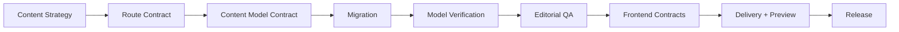
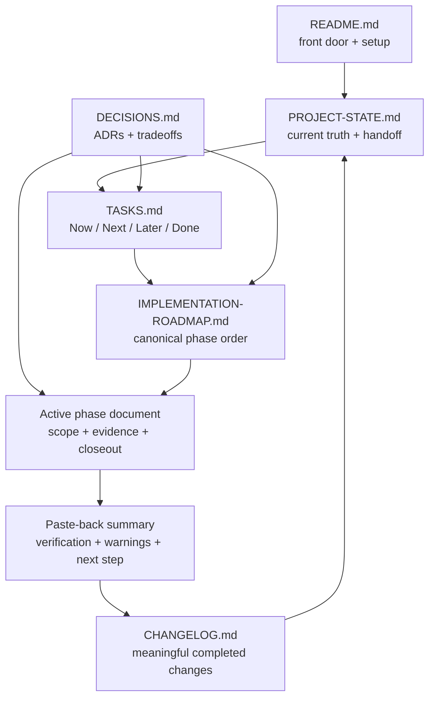

# Contentful Greenfield Starter

A production-minded Contentful project showcasing how I design scalable CMS architecture for a personal website using semantic content models, safe environment workflows, migration-driven schema management, and CMS-agnostic frontend contracts.

The repository demonstrates how I approach content systems with the same structure, documentation, and validation practices used in professional web and CMS environments.


> **Architecture North Star**
>
> Content strategy before content models.<br>
> Routes before templates.<br>
> UI contracts before CMS data.<br>
> Static fixtures before Contentful.<br>
> Validation before closeout.<br>
> Documentation is part of the build.

## Why This Project

Contentful can model a personal website as a durable content system instead of a set of component-shaped database tables. This starter keeps editorial meaning separate from frontend implementation by modeling concepts such as projects, articles, experience, skills, navigation, tools, and lean SEO override inputs.

The project also shows how enterprise CMS practices scale down cleanly: field IDs are governed as API contracts, model changes begin as migrations, snapshots support portability, secrets stay server-side, environments are explicit, and phase gates require evidence before closeout.

## Project Status

| Area | Current state |
| --- | --- |
| Current phase | Phase 02 - Content Model Contract + Bootstrap Migration |
| Latest completed phase | Phase 01 - Complete / Frozen |
| Latest approved batch | Batch 02.4 - References + Validations + Editorial Contract |
| Next batch | Batch 02.5 - Bootstrap Migration Reconciliation + Preflight |
| Previous phase | Phase 00 - Complete |
| Content model | Model design approved V1; migration blocked |
| Environments | `master` + `dev` |
| Bootstrap migration | Blocked / not run |
| Seed content | Not started |

> For canonical current state, see [docs/PROJECT-STATE.md](docs/PROJECT-STATE.md) and [TASKS.md](TASKS.md).

## What This Repository Demonstrates

- **Migration-first schema governance** - Content model evolution is represented through version-controlled migration intent.
- **Semantic Contentful modeling** - Editorial concepts remain independent of React component implementation.
- **Field-ID contract discipline** - Contentful field IDs are treated as long-lived API surfaces.
- **Two-environment CMS safety** - `master` remains protected while `dev` acts as the single rotating sandbox.
- **Model portability** - model-only snapshots support reproducible verification without replacing migration history.
- **CMS-agnostic frontend boundaries** - raw Contentful response shapes stay outside presentational UI.
- **Secret handling discipline** - management, delivery, and preview credentials remain separated and server-side.
- **Evidence-based delivery** - phase progress depends on recorded repository, command, or CMS evidence.

## Architecture Overview



The implementation sequence keeps CMS decisions upstream of templates and keeps UI-facing contracts ahead of live Contentful integration. The full phase sequence, gates, and dependencies live in [docs/IMPLEMENTATION-ROADMAP.md](docs/IMPLEMENTATION-ROADMAP.md).

## Environment Strategy

| Environment | Responsibility | Current posture |
| --- | --- | --- |
| `master` | Permanent protected baseline and future release target | Verified clean protected baseline |
| `dev` | Single rotating sandbox for migration development, model review, and editorial QA | Verified clean sandbox for future approved bootstrap work |

Verification is a workflow state, not a third Contentful environment.

In Phase 03, the approved `dev` model will be exported as a model-only snapshot, recoverability evidence will be recorded, explicit human approval will be required, and `dev` will be recreated from protected `master` before the snapshot is imported back into fresh `dev`. See [docs/system/ENVIRONMENT-STRATEGY.md](docs/system/ENVIRONMENT-STRATEGY.md) for the complete procedure and destructive gate.

## Repository Operating System



Each document owns a different part of project truth. The loop prevents implementation, planning, decisions, and closeout evidence from silently drifting apart.

## Quick Start

```bash
git clone https://github.com/gah-code/contentful-greenfield-starter.git
cd contentful-greenfield-starter

nvm use
npm install

cp .env.example .env.local

node -v
npm -v
npm run cms:help
```

> `.env.local` is intentionally ignored. Never commit Contentful credentials.

## Project Commands

| Command | Type | Purpose |
| --- | --- | --- |
| `npm run cms:help` | read-only | Inspect the locally installed Contentful CLI surface |
| `npm run cms:login` | manual authentication | Authenticate with Contentful only when a phase explicitly allows it |
| `npm run cms:env:check` | local safety check | Verify required env names are configured, target is `dev`, and secret values remain hidden |
| `npm run cms:env:list` | gated live read | List Contentful environments when Batch 00.4 authorizes direct environment evidence |
| `npm run cms:model:bootstrap` | mutating, blocked | Run the bootstrap migration only after Phase 02 authorizes it |
| `npm run cms:model:export` | gated live read | Export a model-only snapshot during the approved model verification phase |
| `npm run cms:model:import:verify` | mutating, gated | Import a model-only snapshot into fresh `dev` during Phase 03 verification |
| `npm run cms:model:verify:snapshot` | local read-only | Validate snapshot structure from a local model export file |

Do not run authentication, migration, export, import, or environment commands unless the current phase gate authorizes them.

## Repository Structure

```text
.
├── .codex/
│   └── skills/
├── content-model/
│   ├── migrations/
│   ├── snapshots/
│   └── reports/
├── docs/
│   ├── content-model/
│   ├── phases/
│   └── system/
├── scripts/
│   └── contentful/
├── README.md
├── TASKS.md
├── CHANGELOG.md
└── package.json
```

`.codex/` contains project-specific operating instructions, `content-model/` holds migrations and portable model artifacts, `docs/` owns canonical planning and architecture truth, and `scripts/` wraps Contentful CLI operations behind local safety checks.

## Roadmap

| Phase | Focus |
| --- | --- |
| 00 | Baseline + Two-Environment Setup - complete |
| 01 | Content Strategy + Route Contract - complete / frozen |
| 02 | Content Model Contract + Bootstrap Migration - active |
| 03 | Model Export + Serial Clean-Room Verification |
| 04 | Editorial QA + Model Freeze |
| 05 | Representative Seed Content |
| 06 | Frontend Contracts + Adapter Boundary |
| 07 | Delivery Integration |
| 08 | Preview + Editorial Workflow |
| 09 | Quality Gates + Release |

See [docs/IMPLEMENTATION-ROADMAP.md](docs/IMPLEMENTATION-ROADMAP.md) for full gates and dependencies.

## Content Model Direction

The historical proposed v1 direction started from 10 semantic content types:

`seoMetadata`, `socialLink`, `navigationItem`, `siteSettings`, `personProfile`, `project`, `article`, `experienceItem`, `skill`, and `skillGroup`.

Phase 02 / Batch 02.2 approves the current v1 standalone type inventory: `siteSettings`, `personProfile`, `socialLink`, `navigationItem`, `project`, `article`, `experienceItem`, `skill`, `skillGroup`, and `tool`. Phase 02 / Batch 02.3 approves the field and field-ID contract. Phase 02 / Batch 02.4 approves the reference, validation, and editorial contract without approving migration execution. The approved inventory keeps semantic content separate from React components, absorbs the broad legacy `seoMetadata` type into owning editorial types, and adds `tool` as a standalone semantic type. Content type ownership lives in [docs/content-model/CONTENT-TYPE-LEDGER.md](docs/content-model/CONTENT-TYPE-LEDGER.md), field contracts live in [docs/content-model/FIELD-ID-LEDGER.md](docs/content-model/FIELD-ID-LEDGER.md), references live in [docs/content-model/REFERENCE-MAP.md](docs/content-model/REFERENCE-MAP.md), and validation/editorial rules live in [docs/content-model/VALIDATION-AND-EDITORIAL-CONTRACT.md](docs/content-model/VALIDATION-AND-EDITORIAL-CONTRACT.md).

## Documentation

### Current State

- [docs/PROJECT-STATE.md](docs/PROJECT-STATE.md) - current truth and handoff state
- [TASKS.md](TASKS.md) - Now / Next / Later / Done tracker
- [CHANGELOG.md](CHANGELOG.md) - meaningful completed changes

### Architecture

- [docs/DECISIONS.md](docs/DECISIONS.md) - ADRs and tradeoffs
- [docs/IMPLEMENTATION-ROADMAP.md](docs/IMPLEMENTATION-ROADMAP.md) - canonical phase sequence
- [docs/system/ENVIRONMENT-STRATEGY.md](docs/system/ENVIRONMENT-STRATEGY.md) - approved two-environment model
- [docs/system/SECURITY-AND-SECRETS.md](docs/system/SECURITY-AND-SECRETS.md) - secret and CLI boundaries
- [docs/system/CONTENT-STRATEGY.md](docs/system/CONTENT-STRATEGY.md) - frozen Phase 01 content-strategy input
- [docs/system/ROUTE-CONTRACT.md](docs/system/ROUTE-CONTRACT.md) - frozen Phase 01 route-contract input
- [docs/system/SEO-AND-METADATA-CONTRACT.md](docs/system/SEO-AND-METADATA-CONTRACT.md) - frozen Phase 01 SEO + metadata input
- [docs/system/CONTENT-REQUIREMENTS-MATRIX.md](docs/system/CONTENT-REQUIREMENTS-MATRIX.md) - frozen Phase 01 content requirements input

### Content Model

- [docs/content-model/CONTENT-TYPE-LEDGER.md](docs/content-model/CONTENT-TYPE-LEDGER.md) - semantic content-type ledger
- [docs/content-model/FIELD-ID-LEDGER.md](docs/content-model/FIELD-ID-LEDGER.md) - field ID contract ledger
- [docs/content-model/REFERENCE-MAP.md](docs/content-model/REFERENCE-MAP.md) - proposed reference contract
- [docs/content-model/VALIDATION-AND-EDITORIAL-CONTRACT.md](docs/content-model/VALIDATION-AND-EDITORIAL-CONTRACT.md) - proposed validation and editorial contract

### Active Phase

- [docs/phases/PHASE-02-CONTENT-MODEL-CONTRACT-AND-BOOTSTRAP-MIGRATION.md](docs/phases/PHASE-02-CONTENT-MODEL-CONTRACT-AND-BOOTSTRAP-MIGRATION.md) - Phase 02 batch plan, existing model reconciliation, decision queue, and migration execution gates
- [docs/phases/PHASE-01-CONTENT-STRATEGY-AND-ROUTE-CONTRACT.md](docs/phases/PHASE-01-CONTENT-STRATEGY-AND-ROUTE-CONTRACT.md) - completed Phase 01 closeout, frozen requirements evidence, and Phase 02 handoff boundary

## Safety and Governance

- Never bootstrap, import, or experiment against `master`.
- Keep `.env.local` ignored, local, and untracked.
- Never expose management, delivery, or preview credentials to browser code.
- Never pass secrets in command-line arguments.
- Treat migrations as canonical model history.
- Treat snapshots as portability evidence, not schema ownership.
- Require recoverability evidence and explicit human approval before destructive `dev` rotation.
- Mark phase work complete only when evidence exists, not when intent is documented.

See [docs/system/SECURITY-AND-SECRETS.md](docs/system/SECURITY-AND-SECRETS.md), [docs/system/ENVIRONMENT-STRATEGY.md](docs/system/ENVIRONMENT-STRATEGY.md), and [docs/DECISIONS.md](docs/DECISIONS.md) for the governing rules.

## Working on This Repository

1. Read [docs/PROJECT-STATE.md](docs/PROJECT-STATE.md).
2. Read [TASKS.md](TASKS.md).
3. Read the active phase document.
4. Inspect relevant ADRs and system docs.
5. Make the smallest approved change.
6. Run the allowed verification.
7. Record evidence.
8. Update truth surfaces only when the gate is actually satisfied.

## Engineering Themes

This project highlights Contentful architecture, content modeling, migration governance, WebOps discipline, frontend/CMS separation, secret safety, technical documentation, SEO-ready content architecture, and editorial workflow design.

## License

The license file declares this repository under the [MIT License](LICENSE).
